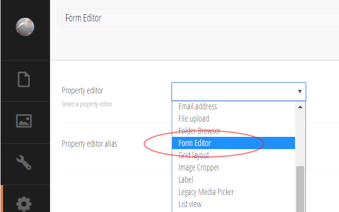
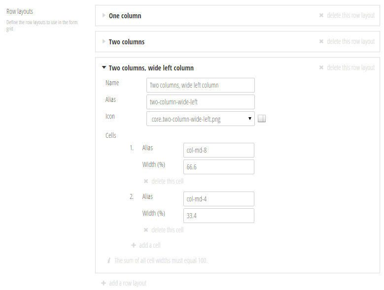

# Installing and setting up Form Editor
Form Editor works just like any other property editor for Umbraco. Or as it happens to be, two property editors. One for the form layout and one for the form submissions. Why two? Because then you can place the form layout and the form submissions on separate tabs. We'll get back to that.

## Installing the package
First and foremost grab the [latest Form Editor package](https://github.com/kjac/FormEditor/releases) and install it in your Umbraco site.

## Setting up the data types
Once the package is installed, go ahead and create data types. You'll need one "Form Editor" data type and one "Form Editor data". 



### Configuring the data type "Form Editor"
The "Form Editor" data type is used for layouting the form and for controlling the form submissions. This is where the bulk of the Form Editor configuration is done.

##### Row layouts
In the "Row layouts" section of the configuration you'll set up the row layouts you want available for your editors. A row layout consists of:
* A **name** and an **icon**, so the editors can tell the row layouts apart.
* An **alias**, so you can identify the row layout when rendering the form.
* Some **cells** that the editors can add form fields to. A **cell** in turn consists of:
    * An **alias**, so you can identify the cell when rendering the form. 
    * The **width** of the cell (in percent of the total row width) when rendered in the Form Editor. Within a row layout, the sum of all cell widths must equal 100.



Form Editor ships with a bunch of row icons, but if you run out of icons you can add more simply by dumping them in */App_Plugins/FormEditor/editor/rows/*.

By default, Form Editor will suggest [Bootstrap](http://getbootstrap.com/css/#grid) style `.col-md-*` classes as cell aliases, mostly because the sample templates shipped with Form Editor use Bootstrap to render the form grid. But Form Editor is not tied to Bootstrap in any way. You have complete control over the [form rendering](render.md), so just use whatever cell alias that makes sense. 

##### Disallowed field types
Don't want your editors adding certain field types to their forms? No problem. Just add these field types to the list of disallowed field types.

##### Email templates
Form Editor supports two different types of emails - notification emails (sent to specific recipients of the editor's choosing) and confirmation emails (sent to the end users when submitting the form).

You can choose separate email templates for notification and confirmation emails, or leave them blank if you don't want to support one or both types of emails. See [Email templates](emails.md) for more info.

##### The rest
Hopefully the rest of the "Form Editor" data type configuration is self explanatory. Oh, and it's strongly recommended to hide the property label to give the "Form Editor" property as much space as possible.

### Configuring the data type "Form Editor data"
This should be pretty straight forward. Once again, it's highly recommended to hide the property label.

## Setting up the content type
When you have configured the data types, create a content type (or reuse an existing) and add properties based on the new data types. If you're going to use the sample templates, make sure the "Form Editor" property has the property alias "form".

Since both properties take up a lot of space in the UI, you should consider placing them on separate tabs - e.g. "Form layout" and "Form data".

**Please note:** You can only have *one* "Form Editor" property per content type.

## Configuring reCAPTCHA
Form Editor supports [reCAPTCHA](https://www.google.com/recaptcha/) out of the box. However, for it to work you'll need to add your reCAPTCHA keys to the `<appSettings/>` of your site:
* The reCAPTCHA "site" key goes in the app setting `FormEditor.reCAPTCHA.SiteKey`
* The reCAPTCHA "secret" key goes in the app setting `FormEditor.reCAPTCHA.SecretKey`

```xml
  <appSettings>
    <!-- ... -->
    <add key="FormEditor.reCAPTCHA.SiteKey" value="****" />
    <add key="FormEditor.reCAPTCHA.SecretKey" value="****" />
  </appSettings>
```

## Next step
Onwards to [Rendering the form](render.md).
