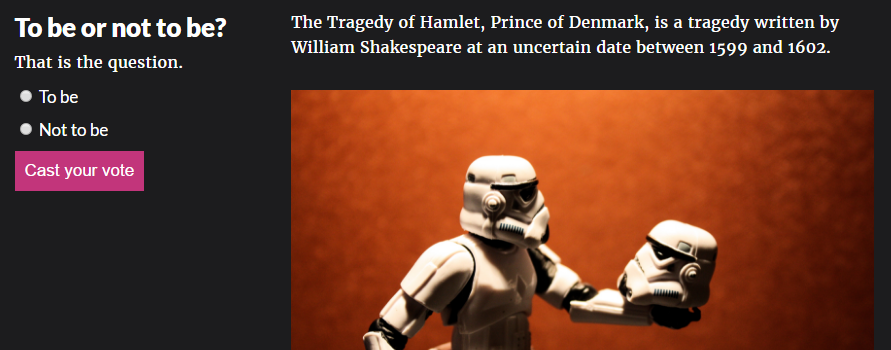
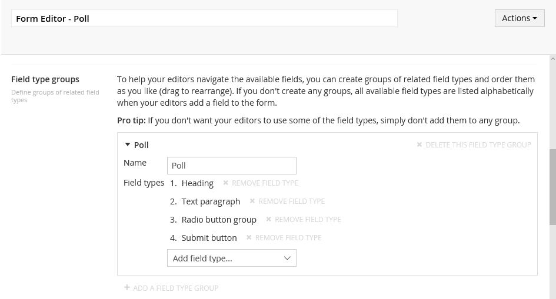
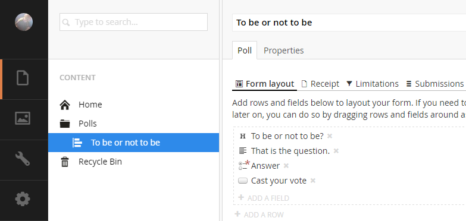
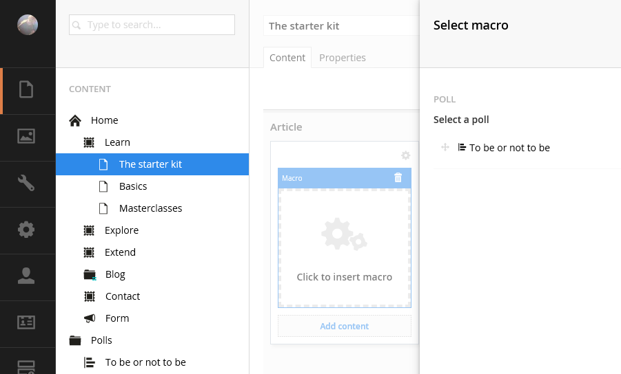
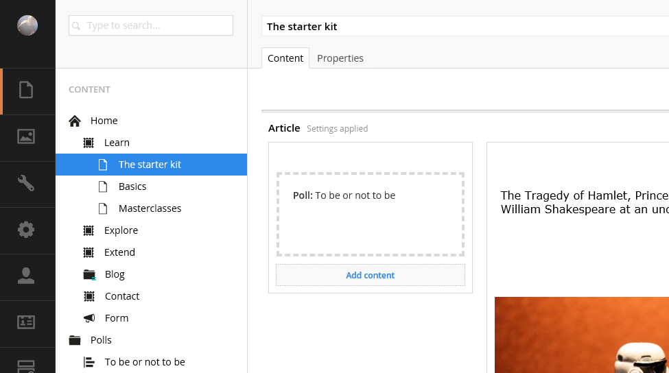

# Creating a poll with Form Editor
In this tutorial you'll use Form Editor to add polls to the Fanoe starter kit.



If you haven't already completed the [Hello Form Editor](HelloFormEditor.md) tutorial you should, as this tutorial in part builds on top of the Hello Form Editor tutorial.

## Goals
Before we start, let's figure out what we want to achieve.
1. A poll should be reusable, so it can be added to multiple pages.
2. A poll should be rendered as part of the grid to blend with the rest of the site content.
3. A poll may not interfere with other forms on the page - e.g. the footer contact form from the Hello Form Editor tutorial.
4. A poll may not be answered multiple times by the same user.

## Setting it all up in Umbraco
### The data type
A poll is a really simple form. It consists of a question (some text), an answer (radio buttons) and a submit button. Therefore we should help the editors by limiting the available fields for polls, so they don't start adding input fields of all sorts. Fortunately that's easy to do with Form Editor.

Start by creating a new Form Editor data type and name it *Form Editor - Poll*. Now make the following changes to the default data type configuration:
- Check *Hide label* to give the form as much space as possible when editing.
- Remove the two column row layout - we only want a single column for the polls.
- Create a field type group containing the field types *Heading*, *Text paragraph*, *Radio button group* and *Submit button*. 

- Check *Don't use validation* - cross field validation makes no sense for polls, so the editors don't need to be concerned with it.
- Check *Use form statistics* so we can generate a bar chart of the poll results.

### The document types
We need two document types: One for the polls and one for the folder that should contain the polls in the content tree:
1. Create a *Poll* document type with a single property based on the newly created *Form Editor - Poll* data type. Make sure the property alias is *form*.
2. Create a *Poll folder* document type. On the permissions tab, enable *Allow at root* and add the *Poll* document type as allowed child type.

### The macro
This isn't a tutorial on how to use the grid, so we'll go with the easiest way of rendering the poll within the grid - by using a macro. 

Create a macro template (partial view macro file) called *Poll* and let Umbraco create a macro for it. For the time being, just add some dummy markup to the macro template, e.g. ```<p>This is where the poll will be rendered</p>```.

Now edit the *Poll* macro and make the following changes:
1. Tick *Use in rich text editor and the grid* and *Render in rich text editor and the grid* and hit save.
2. Add a macro parameter with the alias *pollPicker* of the type *Content Picker*. We'll use this to pick the poll that should be rendered by the macro. 

## Building the poll
Before we go any further, we need a poll to work with. Start by creating a folder for the polls (of type *Poll folder*) in the root of the content tree and hit save and publish. 

Now add a *Poll* document to the folder. You can layout the poll any way you want, within the limitations we've imposed on the *Form Editor - Poll* data type. Here's a suggestion:
- Add a *Heading* and a *Text paragraph* field for some intro text and the question to ask the users.
- Add a *Radio button group* for the answer. You should leave it blank (no option checked) by default and add a required validation with a suitable error message.
- Add a *Submit button* so the users can submit their answer.



When you're done layouting the poll, switch to the *Receipt* tab and enter a thank-you message to show when the users answer the poll.

We need to make sure that the users only answer the poll once. Switch to the *Submissions* tab, tick *Only one submission per user* and enter a suitable message for the users that have already submitted the form. 

Finally hit save and publish.

## Rendering the poll in the grid
It's time to get some rendering done. Edit one of the text pages in the content tree and add an *Article* row to the grid. Now add a *Poll* macro to the left hand cell and select the poll you just created as value for the *pollPicker* macro parameter. 



Once you've selected the poll, the *Poll* macro should render the dummy markup we added previously, both within the grid editor and in frontend. We'll improve on that later, but first....

### Some AngularJS fun
We're going to use asynchronous form postback ([read more](../Docs/render.md)) for the polls, to avoid a full page reload upon answering a poll. We've already got some of the setup covered for the contact form we created in the Hello Form Editor tutorial. However, now that we start having multiple forms on the same page, we run into an issue because of the way AngularJS works.

AngularJS does not allow multiple `ng-app` directives on the same page, but the Form Editor partial view declares `ng-app` each time it's called by default. To avoid this we need to tell the Form Editor partial view not to declare `ng-app` and then declare it ourselves in an outer scope:

1. Add `ViewBag.FormAppDeclared = true;` to */Views/Master.cshtml* just before calling the Form Editor partial view that renders the contact form.
```cs
// tell the Form Editor async rendering that ng-app is declared in an outer scope
ViewBag.FormAppDeclared = true;
// call the Form Editor async rendering
@Html.Partial("FormEditor/Async", Umbraco.AssignedContentItem)
```
2. Create a new AngularJS app that includes Form Editor by adding this script block as the very last script in */Views/Master.cshtml*:
```html
<script type="text/javascript">
  // this is your site app. it needs to include the "formEditor" module.
  var myApp = angular.module("myApp", ["formEditor" /* add other modules to your app here */])
</script>
```
3. Declare the app in the `<body>` tag:
```html
<body ng-app="myApp">
```

### Rendering the poll
To render the poll in the grid, replace the dummy markup in your *Poll* macro template with the macro template below. When you read through it, keep the following in mind:

- Rendering the poll form is no different from rendering the contact form. You need to:
    1. Tell Form Editor to render the selected poll from the *pollPicker* macro parameter.
    2. Tell Form Editor not to declare `ng-app`.
    3. Call the partial view for asynchronous form postback.
- We want to show the poll results to the users once they've answered the poll. The [documentation](../Docs/submissions.md) describes how to work with the form submission statistics, and this has been added to the macro template. 
- The *Poll* macro is configured to be rendered within the backend grid editor. The macro template detects this and renders some useful info for the editors in the backend.

```html
@using FormEditor
@inherits Umbraco.Web.Macros.PartialViewMacroPage
@{
    // get the selected content (if any)
    var pollId = Model.MacroParameters["pollPicker"];
    var poll = pollId == null ? null : Umbraco.TypedContent(pollId);
    // is the selected content of type "poll"?
    var isPoll = poll != null && poll.DocumentTypeAlias == "poll";
}

@* magic way of determining if the macro is being rendered for backoffice preview *@
@if (Request.Url.AbsolutePath.Contains("GetMacroResultAsHtmlForEditor"))
{
    // has anything been selected?
    if (poll == null)
    {
        <p>Please select a poll</p>
    }
    // is the selected item a poll?
    else if (isPoll == false)
    {
        <p>
            <b>The selected content is not a poll</b>
        </p>
    }
    // we're good - show the name of the poll
    else
    {
        <p>
            <b>Poll:</b> @poll.Name
        </p>
    }
    // stop rendering here, we don't want to render the actual poll form in the backoffice preview
    return;
}

@* from here on out we're rendering for frontend *@
@if (isPoll == false)
{
    // no poll selected, nothing to render
    return;
}

<div class="form-editor">
    @{
        // get the form and check if the current user has already submitted it (max submissions exceeded for current user)
        var form = poll.GetPropertyValue<FormModel>("form");
        if (form.MaxSubmissionsExceededForCurrentUser(poll) == false)
        {
            // the current user has not submitted the form so let's render it:
            // - tell Form Editor where to look for the form property
            ViewBag.FormContent = poll;
            // - tell the Form Editor async rendering that ng-app is declared in an outer scope
            ViewBag.FormAppDeclared = true;
            // - call the Form Editor async rendering
            @Html.Partial("FormEditor/Async", Umbraco.AssignedContentItem)
        }
        else
        {
            // the current user already submitted the form - we'll show the submissions statistics instead of the form
            var statistics = form.GetFieldValueFrequencyStatistics(poll);
            // get the submission statistics for the first applicable field - this will always be the answer field due to the poll form setup
            var fieldValueFrequencies = statistics.FieldValueFrequencies.FirstOrDefault();

            <div class="container">
                <div class="row one-column">
                    <div class="cell col-md-12">
                        @* first render the "max submissions exceeded for current user" message *@
                        <h2>@form.MaxSubmissionsForCurrentUserExceededHeader</h2>
                        <p>
                            @form.MaxSubmissionsForCurrentUserExceededText
                        </p>
                        @* then render the submission statistics as a simple bar chart *@
                        @if (fieldValueFrequencies != null)
                        {
                            <ul class="formStatistics">
                                @foreach (var fieldValueFrequency in fieldValueFrequencies.Frequencies)
                                {
                                    // calculate the frequency in percent
                                    var frequencyInPercent = (100.0*fieldValueFrequency.Frequency)/statistics.TotalRows;
                                    <li>
                                        <div>@fieldValueFrequency.Value</div>
                                        <div class="formStatisticsItem" title="@Math.Round(frequencyInPercent, 1)%" style="width: @frequencyInPercent%;"></div>
                                    </li>
                                }
                            </ul>
                        }
                    </div>
                </div>
            </div>
        }
    }
</div>
```

And finally, you'll need to add a bit of extra styling to make it look decent. Try something like this:

```css
/* reset some of the widths and spacings in the Fanoe grid so we don't apply them twice */
div.grid-section div.form-editor div.container {
	width: auto;
	padding: 0 15px;
}
div.grid-section div.form-editor div.container div.form-group {
	margin: 0;
}
div.grid-section div.form-editor div.form-receipt {
	padding: 0px 15px;
	margin: 15px;
}

/* styles for the simple bar chart */
ul.formStatistics {
	list-style: none;
	margin: 0;
	padding: 0;
}
ul.formStatistics li div.formStatisticsItem {
	display: inline-block;
	height: 15px;
	background-color: #C2357B;
}
```

If everything went well, the *Poll* macro should now render the name of the selected poll in the grid editor, and the frontend poll rendering should look something like the image at the top of this tutorial.

