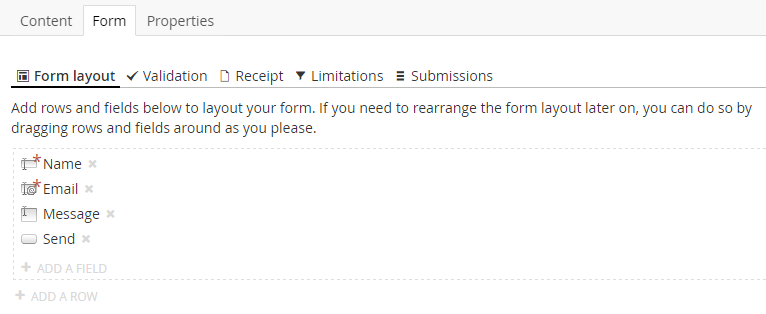
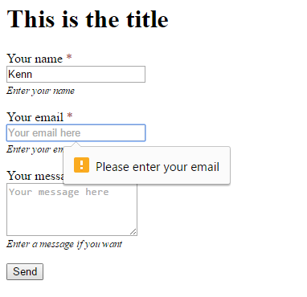

# Quick start tutorial

Are you all new to Form Editor? No worries, this tutorial was made specifically for you. Just follow these steps and you'll be up and running in no time!

## Step 1: Install and set up Form Editor
Go grab the latest version of the Form Editor Umbraco package from the [releases section](https://github.com/kjac/FormEditor/releases) (it's the zip file attached to the release) and install it in the Developer section of Umbraco. 

*Tip:* You can also install Form Editor from [NuGet](https://www.nuget.org/packages/FormEditor/) if you feel like it.

Once the package is installed, create a new data type of type *Form Editor*. 

## Step 2: Add Form Editor to your document type
In the Settings section of Umbraco, edit the document type you want the form added to.

Add a property of the newly created Form Editor data type to the document type. Make sure the property alias is *form*.

Note: It's highly recommended to create a tab dedicated to the form property, as Form Editor takes up a lot of space in the editor UI.

## Step 3: Render the form
In your page template, add the following line where you want the form property rendered:

```cs
@Html.Partial("FormEditor/NoScript", Umbraco.AssignedContentItem)
```

...and add a bit of styling for required fields:

```xml
<style>
    /* required field indicator on the field labels */
    div.form-group.required > label:after {
        content: ' *';
        color: #a94442;
    }
</style>
```

Of course you'll need to style the form elements too, but that's out of scope for this quick start tutorial.

## Step 4: Profit :)
Now go build a form on one of your pages and publish it. 



If everything goes according to plan, you should now have a fully functional form on your page.



## About the form rendering
Form Editor ships with several rendering options out of the box, and you can also build your own from scratch. In this tutorial we have used the simplest one, the *NoScript* rendering. You can read more about the different rendering options [here](../Docs/render.md).

## Sample template
Just in case you need it, here's a complete template that includes all of the above mentioned rendering.

```xml
@inherits Umbraco.Web.Mvc.UmbracoTemplatePage
@{
    Layout = null;
}
<!DOCTYPE html>
<html>
<head>
    <title>@Model.Content.Name</title>
    @* add some styles for Form Editor *@
    <style>
        /* required field indicator on the field labels */
        div.form-group.required > label:after {
            content: ' *';
            color: #a94442;
        }

        /* some basic form element styling to make it look a little bit nicer */
        div.form-group {
            margin-bottom: 1em;
        }
        div.form-group label, div.form-group input, div.form-group select, div.form-group textarea {
            display: block;
        }
        div.form-group span.help-block {
            font-size: 0.8em;
            font-style: italic;
        }
    </style>
</head>
<body>
    @* render the "title" property *@
    <h1>@Model.Content.GetPropertyValue("title")</h1>

    @* render the "form" property *@
    @Html.Partial("FormEditor/NoScript", Umbraco.AssignedContentItem)
</body>
</html>
```